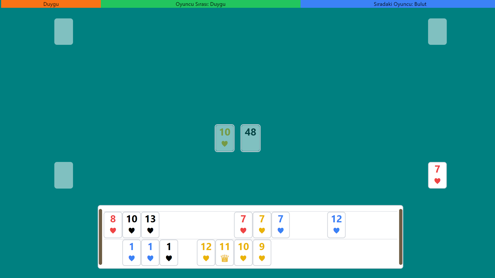

readme_content = """
# Okey Game (React + Vite + Tailwind + Socket.io)

Bu proje, **React**, **Vite**, **Tailwind CSS** ve **Socket.io** kullanarak geliştirilmiş bir **Okey Oyunu** uygulamasıdır. Oyuncuların gerçek zamanlı olarak birbirleriyle etkileşimde bulunabileceği bir masa oyunu sunar.





## Özellikler
- **Gerçek Zamanlı Oyun**: Socket.io ile oyuncular arasında anlık iletişim.
- **Sürükle Bırak (Drag & Drop)**: Okey taşlarını kolayca hareket ettirebilme.
- **Responsive Tasarım**: Tailwind CSS ile mobil uyumlu arayüz.

---


## Kurulum

Bu projeyi kendi bilgisayarınızda çalıştırmak için aşağıdaki adımları izleyin.

### Gereksinimler
- **Node.js** (v16+)
- **npm** veya **yarn**

### 1. Sunucu (Server) Kurulumu

Öncelikle Socket.io sunucusunu kurun ve çalıştırın:

```bash
cd socket
npm install
nodemon server.js
```

Sunucu başarılı bir şekilde başlatıldığında, Socket.io sunucunuz **localhost:3000** adresinde çalışacaktır.

### 2. Uygulama (Client) Kurulumu

Okey oyunu arayüzünü başlatmak için aşağıdaki adımları izleyin:

```bash
cd app
npm install
npm run dev
```

Bu komut, React uygulamasını **localhost:5173** üzerinde başlatacaktır.

**Üretim için**:

```bash
npm run build
```

Yukarıdaki komut, uygulamanın optimize edilmiş bir üretim versiyonunu oluşturacaktır.

---

## Kullanım

1. Sunucu ve uygulama başarıyla başlatıldıktan sonra tarayıcınızda `http://localhost:5173` adresine gidin.
2. Oyuna giriş yaparak bir masa oluşturabilir veya mevcut bir masaya katılabilirsiniz.
3. Taşları sürükleyip bırakarak oyun tahtasında hareket ettirin.

---

## Proje Yapısı

```
.
├── app/                 # React Client (Oyun Arayüzü)
├── socket/              # Socket.io Server
├── README.md            # Açıklama Dosyası
└── package.json         # Proje Bağımlılıkları
```

- **app/**: React, Vite, ve Tailwind CSS ile yazılmış istemci tarafı kodları içerir.
- **socket/**: Node.js ve Socket.io kullanılarak geliştirilmiş gerçek zamanlı sunucu.

---

## Kullanılan Teknolojiler
- **React**: UI geliştirme için.
- **Vite**: Hızlı geliştirme ve yapılandırma için.
- **Tailwind CSS**: Stil ve responsive tasarım için.
- **Socket.io**: Gerçek zamanlı iletişim için.

---

## Katkıda Bulunma

Katkıda bulunmak isterseniz, lütfen bir **pull request** gönderin. Yeni özellikler, hata düzeltmeleri veya iyileştirmeler memnuniyetle karşılanır.

---

## Lisans

Bu proje MIT Lisansı ile lisanslanmıştır.